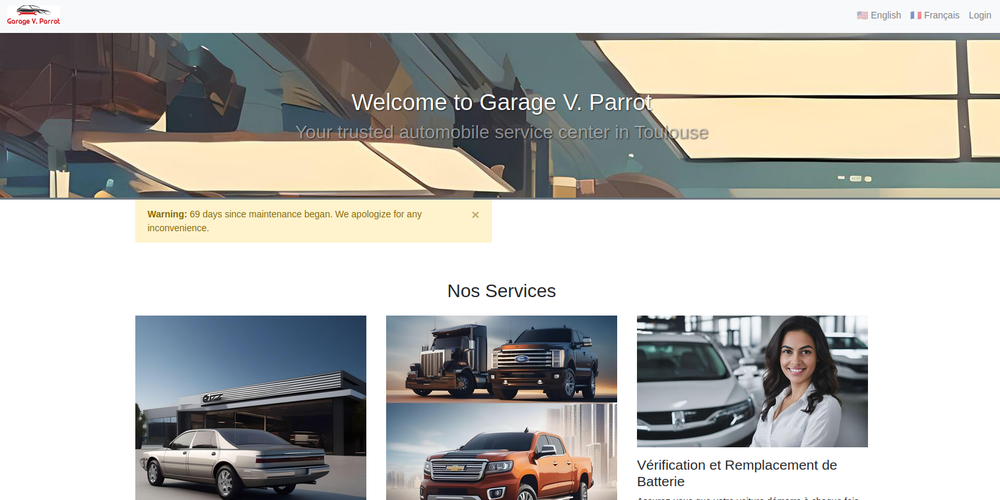
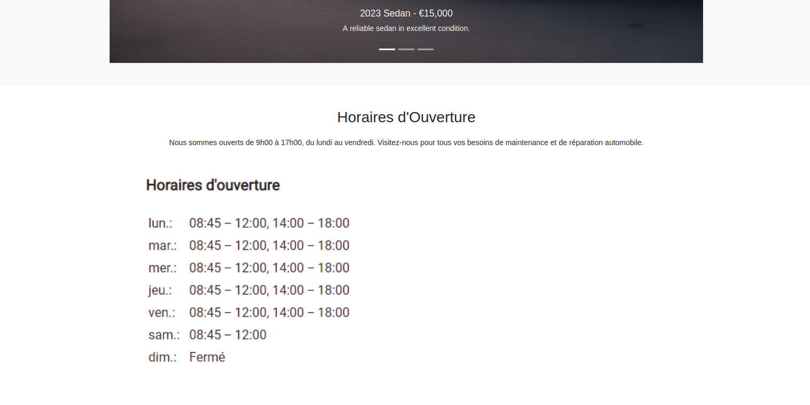
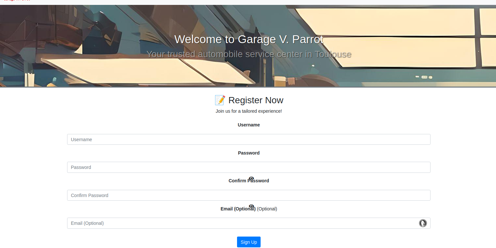

# Garage V. Parrot Web Application

# Overview





Garage V. Parrot, established by Vincent Parrot in Toulouse, is dedicated to providing a broad range of automobile services, including repair, maintenance, and the sale of used vehicles. Recognizing the importance of online visibility in today’s market, we aim to establish a web presence that reflects the quality and reliability of his services.

This project encompasses the development of a web application to serve as an online platform for Garage V. Parrot, facilitating the garage to showcase its services, list used vehicles for sale, and interact with customers through testimonials and contact forms.

## Project Management

- **Trello Board**: To keep track of the project's progress, tasks, and collaboration, visit our [Trello board](https://trello.com/b/eR2X9dfh).
- **GitHub Repository**: The source code and project resources are available on our [GitHub repository](https://github.com/Kvnbbg/au-garage/).
- **Live Application**: Access the live version of the Garage V. Parrot application here [Live app](https://au-garage-92dd5c42a6c4.herokuapp.com/).

## Installation Instructions

### Prerequisites

- Python 3.8+
- pip (Python package manager)
- A SQL database system (e.g., PostgreSQL)

### Setup

1. **Clone the Repository**: Obtain a copy of the project on your local machine.
    ```bash
    git clone https://github.com/Kvnbbg/au-garage/
    cd au-garage
    ```

2. **Install Dependencies**: Use pip to install the required Python packages.
    ```bash
    pip install -r requirements.txt
    ```

3. **Database Initialization**: Configure your SQL database connection and initialize the database schema.
    ```bash
    flask db upgrade
    ```

4. **Environment Variables**: Create an `.env` file in the project root to store environment variables such as the database connection string.

5. **Run the Application**: Start the Flask application.
    ```bash
    flask run
    ```
    The application will be accessible at `http://localhost:5000`.

## Usage

Navigate to the web application using the provided URL to explore the services offered by Garage V. Parrot. The site allows users to view available services, used vehicles for sale, submit testimonials, and contact the garage.

## Contributing

Contributions to the au-garage project are welcome. Please refer to the [CONTRIBUTING.md](https://github.com/Kvnbbg/au-garage/CONTRIBUTING.md) document for guidelines on how to contribute.

## License

This project is licensed under a custom licensing model tailored to meet the specific commercial and development needs of Garage V. Parrot. For detailed license information, please refer to the [LICENSE.md](https://github.com/Kvnbbg/au-garage/LICENSE.md) file in the repository.

## Contact

For inquiries, suggestions, or contributions, please open an issue in the GitHub repository. Your feedback and contributions are highly appreciated.

Thank you for your interest in the web application project.